# 🌍 GeoEase

GeoEase adalah aplikasi inovatif yang dirancang untuk memudahkan proses penginputan data survei lapangan, khususnya di area kajian Kota Pekalongan. Aplikasi ini memungkinkan pengguna untuk secara langsung mengonversi data survei ke dalam format digital yang akurat, serta menampilkan lokasi titik survei dengan bantuan peta interaktif. Fitur unggulan GeoEase mencakup menu edit data yang memudahkan pengguna dalam mengupdate atau mengoreksi informasi yang telah dimasukkan. Sebagai contoh, aplikasi ini dapat digunakan untuk survei fasilitas umum seperti rumah sakit dan kantor polisi, memberikan informasi yang lebih terstruktur dan mudah diakses untuk keperluan analisis dan perencanaan. Dengan GeoEase, proses pengumpulan dan pengelolaan data survei menjadi lebih efisien dan akurat.

# ✨ Fitur Utama:

🗺 Inventarisasi data survey lapangan menjadi digital yang terintegrasi.

➕ Penambahan titik data survey lapangan berdasarkan lokasi pengguna yang terakses internet.

📊 Pengelolaan data survey lapangan dan visualisasi hasil survey dalam sebuah peta interaktif.

# 🛠 Komponen Pembangun Produk

### *1. Antarmuka Pengguna (Frontend)*

- HTML: Struktur dokumen dan elemen UI seperti form dan tombol.
- CSS: Gaya dan tata letak, termasuk animasi dan efek visual.
- JavaScript: Logika interaktif untuk peta, formulir, dan integrasi API.

### *2. Library dan Framework*

- React Native: Mengembangkan aplikasi mobile dengan kode yang dapat berjalan di berbagai platform.
- Leaflet.js: Library JavaScript untuk peta interaktif.
- Fetch API: Untuk komunikasi antara frontend dan backend.
- FontAwesome: Sebagai penyedia ikon sehingga aplikasi terlihat lebih menarik.

### *3. Backend*

- Endpoint API: Berbasis REST untuk mengelola data survey yang disimpann dalam file 'geoease.json'.
  - *POST /geoease*: Menambahkan data survey baru.
  - *GET /geoease*: Mengambil data survey yang telah ada.

### *4. Sumber Data*

- Data Titik Survey (Yang Sudah Ada): Shapefile fasilitas umum Kota Pekalongan.
- data Titik Survey (Yang Belum Ada): Hasil penambahan titik data survey lapangan.

# 🖼 Tangkapan Layar Komponen Penting Produk #

### *1. Home/List*

🏠 Halaman utama untuk menampilkan data survey yang telah ada.

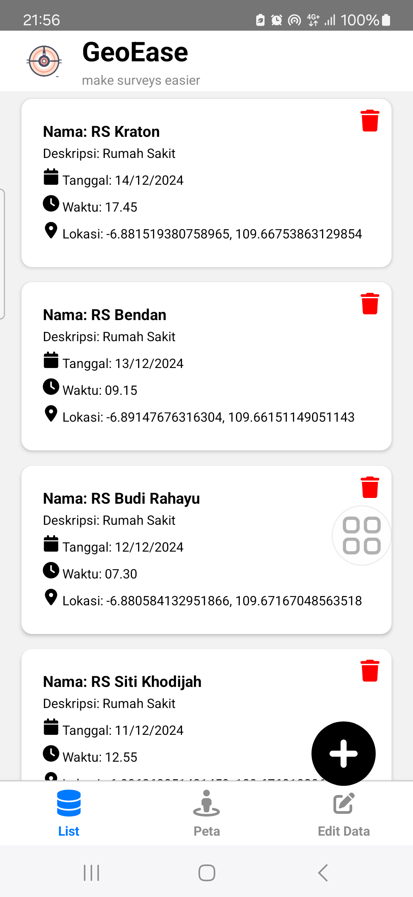

### *2. Tambah Data*

📋 Form untuk mengisikan data survey lapangan baru dengan memanfaatkan geolocation untuk mendapatkan posisi akurat dari pengguna.

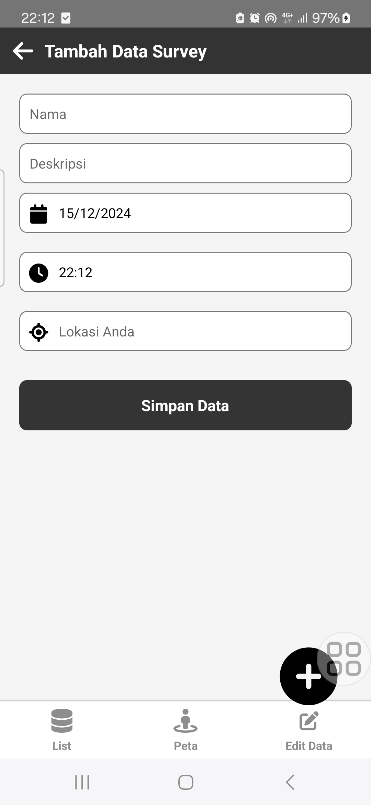
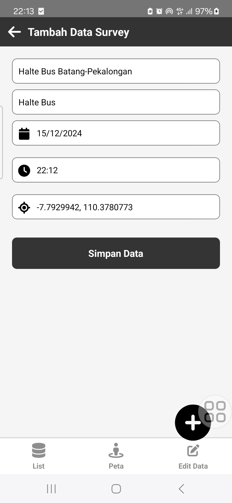
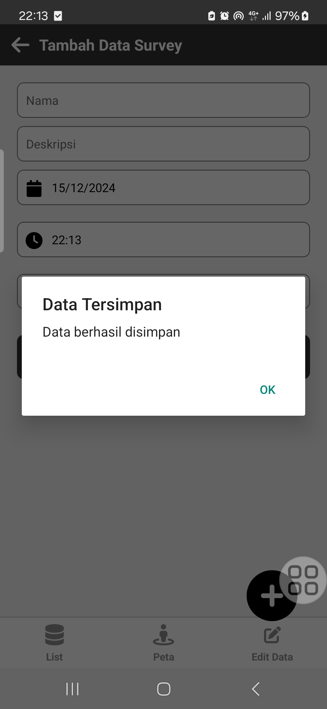
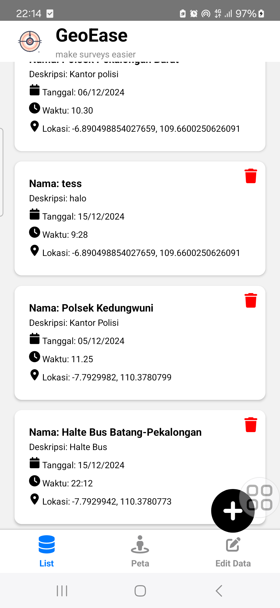

### *3. Map*

🗺 Menampilkan peta interaktif yang menampilkan data survey lapangan yang telah ada serta titik data survey lapangan yang baru ditambahkan beserta informasi pop up dari atribut data.

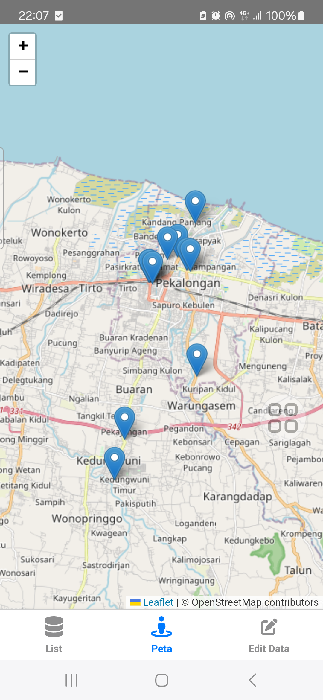
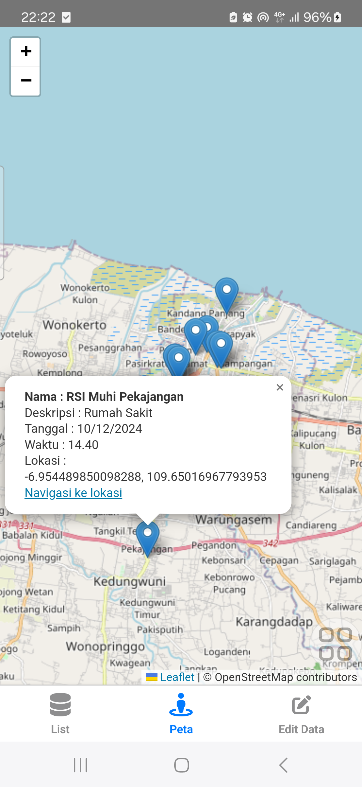
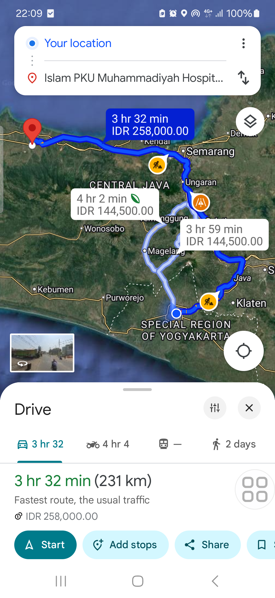

### *4. Edit Data*

✏ Menyediakan formulir untuk mengedit data survey lapangan yang sudah ada untuk nama, deskripsi, tanggal, waktu dan lokasi yang bisa mengambil geolocation baru atau mengisikan koordinat secara manual.

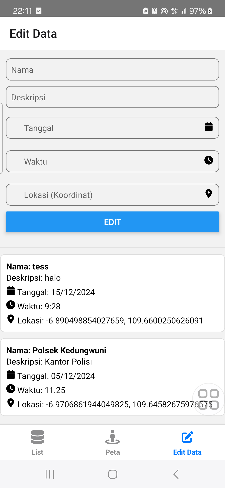
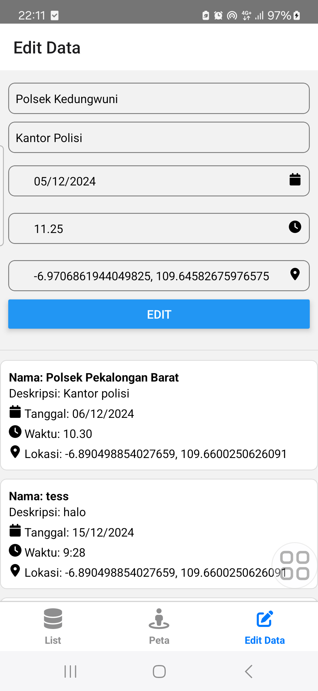
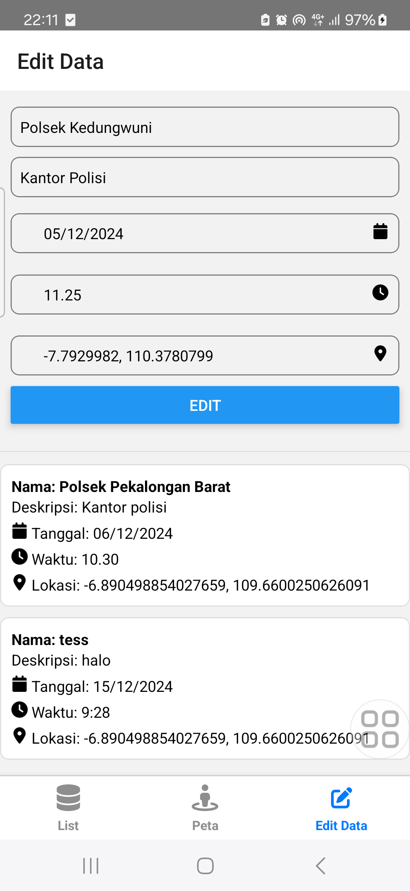
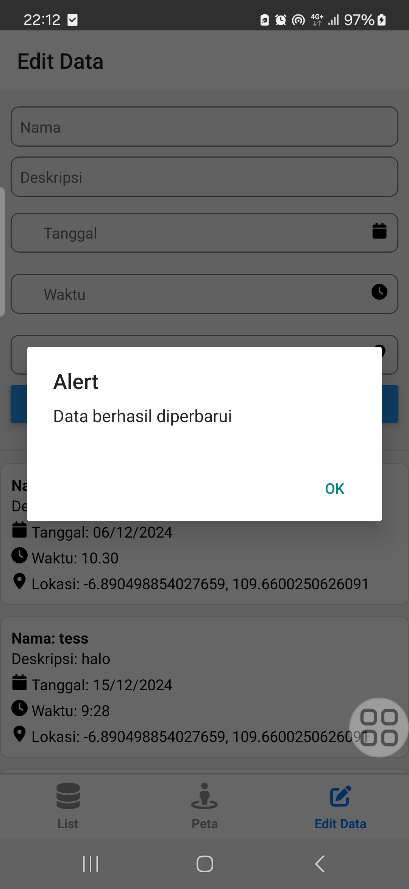
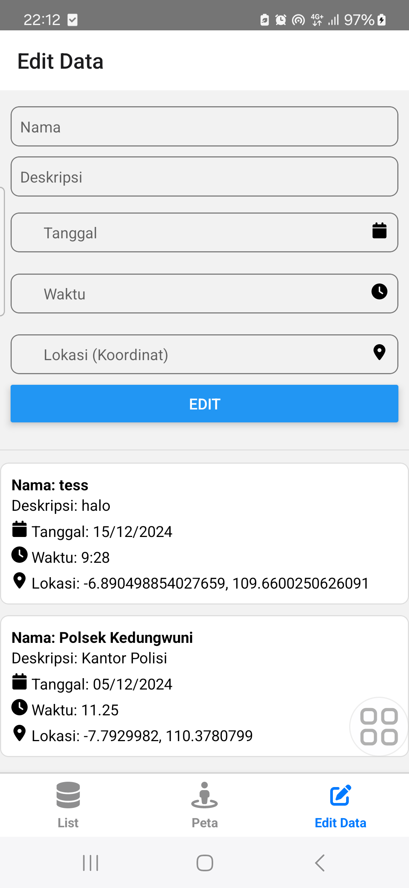
